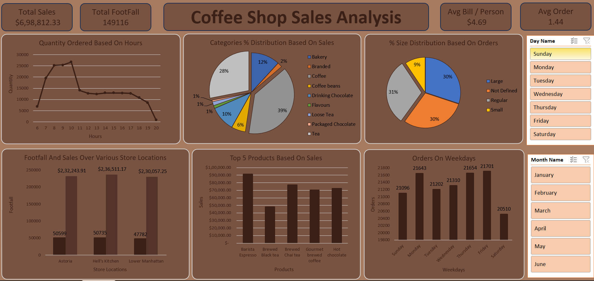

# Coffee Shop Sales Analysis Dashboard

## Overview
This project analyzes sales data from a coffee shop to provide insights into customer behavior, product preferences, and store performance. The dashboard visualizes key metrics such as total sales, footfall, average bill per person, and average order value, alongside more detailed breakdowns of sales by hour, product category, and store location.



## Insights
1. **Peak Hours**: The highest quantity of orders is placed between 8 AM and 11 AM, indicating peak customer traffic during morning hours.
   
2. **Product Categories**: Coffee and coffee-related products dominate sales, with the `Coffee` category accounting for 39% of total sales. Other significant categories include `Bakery` items (12%) and `Packaged Chocolate` (28%).

3. **Order Size Distribution**: Most orders fall within the `Regular` (31%) and `Large` (30%) size categories, with a smaller percentage of customers opting for `Small` (9%) or `Not Defined` sizes.

4. **Store Performance**: Among various store locations, `Hell's Kitchen` has the highest footfall and sales, followed closely by `Lower Manhattan` and `Astoria`. 

5. **Top Products**: The top-selling products are:
   - `Barista Espresso`
   - `Brewed Black Tea`
   - `Brewed Chai Tea`
   - `Gourmet Brewed Coffee`
   - `Hot Chocolate`

6. **Weekly Orders**: Sales peak on `Friday` with the highest number of orders, while `Sunday` has the lowest.

## Tags
- CoffeeShop
- SalesAnalysis
- DataVisualization
- PowerBI
- BusinessInsights
- DataAnalytics
- CustomerBehavior
- ProductPerformance

## How to Use
1. Clone the repository:
    ```bash
    git clone https://github.com/atharvabendre77/coffee-shop-sales-analysis.git
    ```
2. Open the `Coffee-Data-Analysis.png` to explore the visualizations and insights.
3. Feel free to modify and analyze the dataset further to gain additional insights.

## Contributing
Contributions are welcome! If you have suggestions for improving the analysis or visualizations, please submit a pull request or open an issue.


